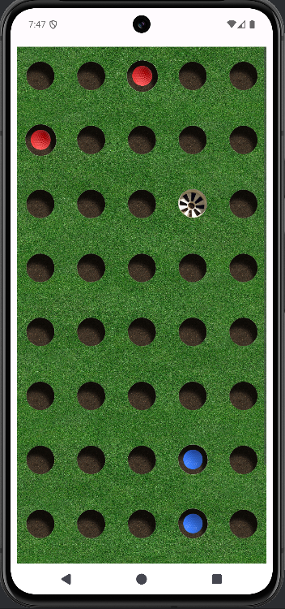
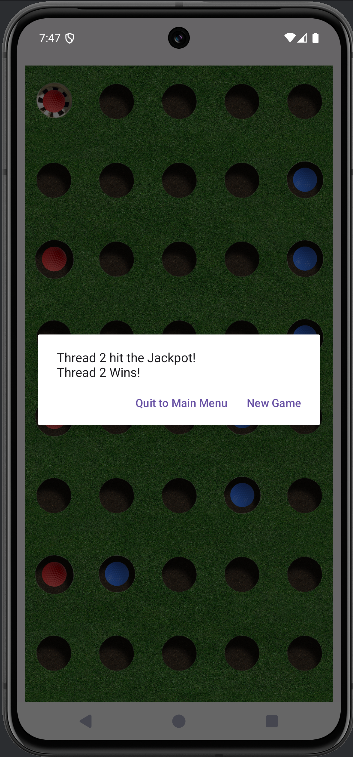
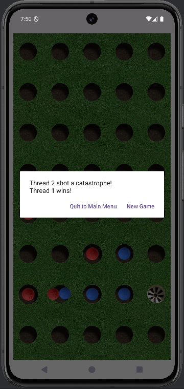

### "Microgolf" - A Game of Dueling Threads

Developed as part of a Mobile App Development course at UIC, this project explores the complexities of thread synchronization and inter-process communication in a real-time Android environment.

### Overview
This project is a simulation of a golf-like minigame where two independent worker threads compete with each other to find a hidden "jackpot" hole within a 50 hole grid. 
The two threads take turns shooting a colored golf ball (blue for player 1, red for player 2) into the holes in search of the jackpot, with each thread following its own simple strategy algorithm. 
Player threads are kept blind to the location of the jackpot, but are given a simple hint by the UI thread after each shot to inform their next move.
The game ends when one thread finds the jackpot, or after one thread shoots their ball into a hole that is already occupied by its competitor (collision).


### Preview
<table>
  <tr>
    <td><b>Game In-Progress</b></td>
    <td><b>Jackpot Win</b></td>
    <td><b>Collision Win</b></td>
  </tr>
  <tr>
    <td></td>
    <td></td>
    <td></td>
  </tr>
</table>

### Technical Highlights

+ **Concurrent Execution**: Creates two distinct worker threads utilizing independent gameplay strategies to solve a spatial search problem.
+ **Thread Synchronization**: Manages safe, bidirectional communication between background threads and the UI thread via Handlers and Loopers to ensure atomic turn-taking.
+ **Inter-Thread Communication**: Follows a "Source of Truth" pattern where the UI thread serves as a broker, providing proximity hints (same row, adjacent, or distant) without exposing the secret jackpot coordinate.
+ **Dynamic Scaling**: Built with modularity in mind; the grid resolution and player strategies can be reconfigured with simple edits to GameConstants.java and PlayerThread.java without refactoring core logic. 
 
#### Worker Thread Isolation and Termination Protocol
A key technical challenge of this simulation is the intentional isolation of worker threads to ensure each "player" was working with limited information. As a result, worker threads treat all end game scenarios (jackpot or collision) the same.
+ **Thread Blindness**: Each worker thread operates in its own memory space and is completely unaware of the other's moves. This prevents threads from simply checking a shared variable to see if a hole is already occupied by its opponent.
+ **Agnostic Worker Shutdown**: Worker threads are result-agnostic regarding the final game outcome; they listen only for a generic game over signal to trigger halting. This decoupling keeps the worker logic lean and delegates win-state evaluation and endgame logic to the UI thread.
+ **Priority Preemption**: Whether a thread finds the jackpot or triggers a collision, the UI thread dispatches a `sendMessageAtFrontOfQueue()` interrupt. This ensures that even if a thread is in the middle of calculating its next "shot," it immediately yields and terminates to maintain system synchronization.
+ **Centralized State Reporting**: The UI thread serves as the final arbiter, capturing the final state of the grid and displaying the appropriate context without requiring the worker threads to track game-ending conditions themselves.

#### Lifecycle Resilience & Context Switching
To handle destructive aspects of the Android Activity lifecycle (such as screen rotations), the system utilizes:
+ **State Persistence**: An Android ViewModel architecture to decouple game execution state from the UI lifecycle.
+ **Graceful Suspension**: The UI thread dispatches a priority pause message to the front of worker message queues during `onPause()`, halting in-progress turns to prevent potential memory leaks or undefined behavior.

#### Thread Communication and Message Flow Diagram
```(Text)
    UI THREAD (Orchestrator)               PLAYER 1 (Worker)         PLAYER 2 (Worker)
      -----------------------               -----------------         -----------------
                 |                                  |                         |
        1. Setup Game State                         |                         |
                 |                                  |                         |
        2. Start Threads ----------------------> [IDLE]                     [IDLE]
                 |                                  |                         |
        3. Post Initial Runnable --------------> [TURN]                       |
                 |                                  |                         |
                 | <---------- 4. Send Shot Message |                         |
                 |                                  |                         |
        5. Process Move (Check Jackpot/Collision)   |                         |
                 |                                  |                         |
        6. Send Shot Result Message -------------> [Update]                   |
                 |                                  |                         |
        7. Post Turn Runnable ----------------------------------------------> [TURN]
                 |                                  |                         |
        8. Repeat Cycle (Steps 4-7) <-----------------------------------------|
                 |                                  |                         |
      [WIN OR COLLISION DETECTED]                   |                         |
                 |                                  |                         |
        9. Send priority message (FrontOfQueue) -> [STOP]                    [STOP]
```

### Built With
+ Language: Java
+ Platform: Android SDK
+ Key Concepts: Multithreading, Handlers, Looper, Thread Synchronization

### How To Run
+ Prerequisites: Android Studio (Ladybug or newer recommended).
+ Setup: Clone, sync gradle, and run on an emulator or Android device with developer mode enabled (API 24+).
